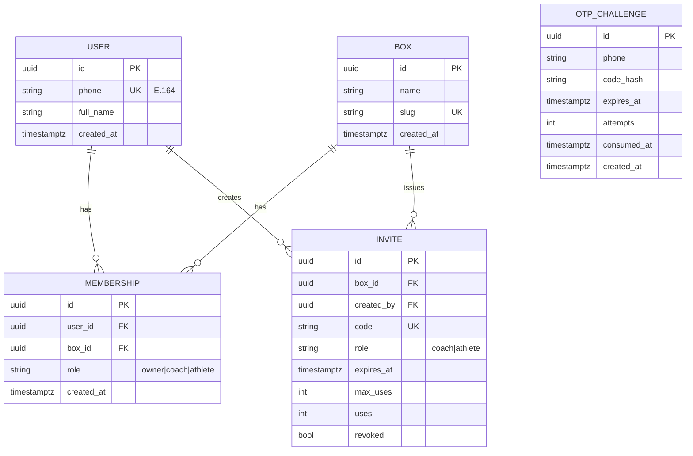

# ERD

```mermaid
erDiagram
    USER ||--o{ MEMBERSHIP : has
    BOX ||--o{ MEMBERSHIP : has
    BOX ||--o{ INVITE : issues
    USER ||--o{ INVITE : creates

    USER {
        uuid id PK
        string phone UK "E.164"
        string full_name
        timestamptz created_at
    }
    BOX {
        uuid id PK
        string name
        string slug UK
        timestamptz created_at
    }
    MEMBERSHIP {
        uuid id PK
        uuid user_id FK
        uuid box_id FK
        string role "owner|coach|athlete"
        timestamptz created_at
    }
    INVITE {
        uuid id PK
        uuid box_id FK
        uuid created_by FK
        string code UK
        string role "coach|athlete"
        timestamptz expires_at
        int max_uses
        int uses
        bool revoked
    }
    OTP_CHALLENGE {
        uuid id PK
        string phone
        string code_hash
        timestamptz expires_at
        int attempts
        timestamptz consumed_at
        timestamptz created_at
    }
```
