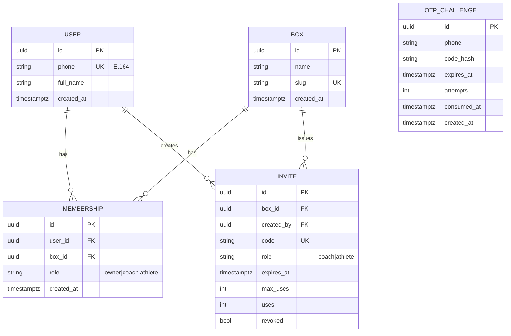
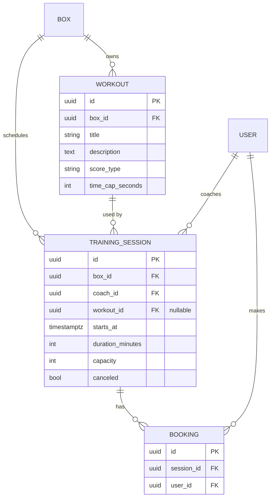
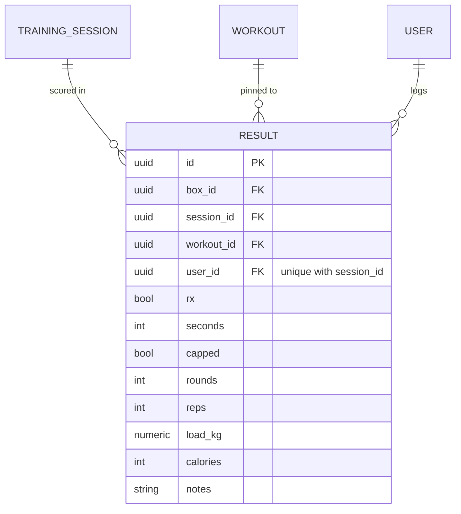

# ERD

```mermaid
erDiagram
    USER ||--o{ MEMBERSHIP : has
    BOX ||--o{ MEMBERSHIP : has
    BOX ||--o{ INVITE : issues
    USER ||--o{ INVITE : creates

    USER {
        uuid id PK
        string phone UK "E.164"
        string full_name
        timestamptz created_at
    }
    BOX {
        uuid id PK
        string name
        string slug UK
        timestamptz created_at
    }
    MEMBERSHIP {
        uuid id PK
        uuid user_id FK
        uuid box_id FK
        string role "owner|coach|athlete"
        timestamptz created_at
    }
    INVITE {
        uuid id PK
        uuid box_id FK
        uuid created_by FK
        string code UK
        string role "coach|athlete"
        timestamptz expires_at
        int max_uses
        int uses
        bool revoked
    }
    OTP_CHALLENGE {
        uuid id PK
        string phone
        string code_hash
        timestamptz expires_at
        int attempts
        timestamptz consumed_at
        timestamptz created_at
    }
```

## Sessions, workouts and bookings

```mermaid
erDiagram
    BOX ||--o{ WORKOUT : owns
    BOX ||--o{ TRAINING_SESSION : schedules
    WORKOUT ||--o{ TRAINING_SESSION : "used by"
    USER ||--o{ TRAINING_SESSION : coaches
    TRAINING_SESSION ||--o{ BOOKING : has
    USER ||--o{ BOOKING : makes

    WORKOUT {
        uuid id PK
        uuid box_id FK
        string title
        text description
        string score_type
        int time_cap_seconds
    }
    TRAINING_SESSION {
        uuid id PK
        uuid box_id FK
        uuid coach_id FK
        uuid workout_id FK "nullable"
        timestamptz starts_at
        int duration_minutes
        int capacity
        bool canceled
    }
    BOOKING {
        uuid id PK
        uuid session_id FK
        uuid user_id FK
    }
```

## Results

```mermaid
erDiagram
    TRAINING_SESSION ||--o{ RESULT : "scored in"
    WORKOUT ||--o{ RESULT : "pinned to"
    USER ||--o{ RESULT : logs

    RESULT {
        uuid id PK
        uuid box_id FK
        uuid session_id FK
        uuid workout_id FK
        uuid user_id FK "unique with session_id"
        bool rx
        int seconds
        bool capped
        int rounds
        int reps
        numeric load_kg
        int calories
        string notes
    }
```
